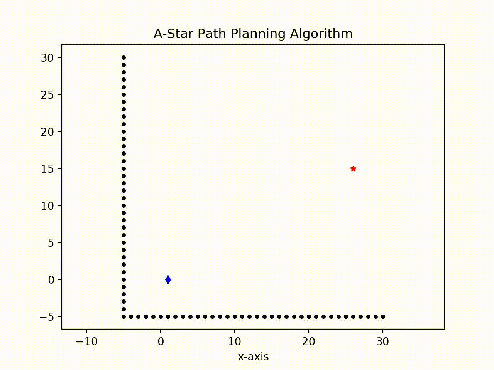

# Path-Planning-A-Star
Implementation of 2D path planning using A Star algorithm

## Without Obstacles
The python file named **"Path_Planning_AStar"** demonstrates path planning using A-Star algorithm. It gets more optimal as the resolution variable is reduced but comes with the cost of more computation.

### Usage
Just clone the file or the repo and you're free to change the boundaries, the start points, the goal points and the resolution. Running the script will dynamically compute the path and simultaneously plot the path. After completing the run, it returns a mpeg file saving the path traversed as a video for more graphical interpretation as shown below.  

Blue diamond - start point  
Red star - goal point  
Green dots - search points  
Orange - the path  

**Note** : I had to convert it to gif to embed it in the markdown.  

  
